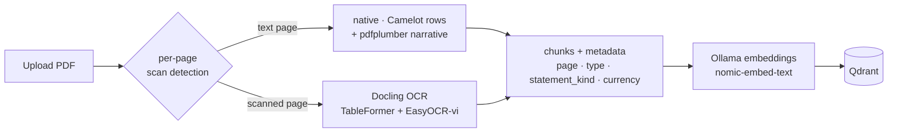
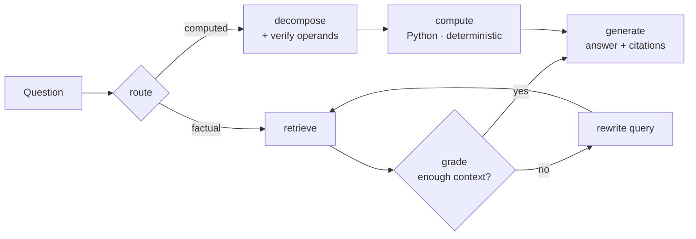

# Financial Report Analysis Agent

> An **agentic RAG** system that answers business questions from annual **financial-report PDFs** — grounded in the source, with **deterministic numeric reasoning** — and runs **100% locally** (no data ever leaves the machine).

Ask *“What was the gross profit margin in 2025?”* or *“How much did net profit grow year-over-year?”* against a company’s annual report and get an answer that is **traceable to a page** and, for calculations, **computed in Python rather than guessed by the LLM**.

**Stack:** LangChain · LangGraph · Ollama (Qwen2-7B + nomic-embed-text) · Qdrant · Camelot / pdfplumber · Docling OCR · FastAPI · Python

---
## Demo


## Highlights

- **Agentic graph, not blind tool-calling.** A LangGraph state machine makes each step explicit — *route → (retrieve → grade → rewrite) | (decompose → compute) → generate* — so the pipeline is debuggable and doesn’t depend on a small model reliably calling tools.
- **Deterministic math = source of truth.** For ratio/growth questions, Python selects the formula and computes from **verified operands read out of the document**; the LLM only rephrases. If operands can’t be verified, the system **abstains instead of fabricating**.
- **Hybrid retrieval tuned for financial tables.** Dense + BM25 → cross-encoder rerank → **section-aware boost** that lifts the primary statement line above look-alike numbers in MD&A / notes.
- **Handles native *and* scanned reports**, Vietnamese and English, with table structure preserved.
- **Rigorous, versioned evaluation** (Recall@K, numeric accuracy, LLM-as-a-judge, negative/trap questions) with automatic failure dumps — every change is measured and logged.

## Latest results — `v7.5` (6 reports · 179 questions · local Qwen2-7B)

| Report | Extraction | Judge (QA) | Recall@5 | Numeric | Compute (%) | Negative |
|---|---|---:|---:|---:|---:|---:|
| Dược Hậu Giang | scan / OCR | **96.4%** | 96.2% | 100% | 2/2 | 2/2 |
| Sabeco | scan / OCR | **89.7%** | 81.5% | 71.4% | 2/2 | 1/2 |
| Vinamilk | native | **89.3%** | 84.6% | 80.0% | 2/2 | 1/2 |
| PV GAS | scan / OCR | **89.3%** | 84.6% | 90.5% | 2/2 | 1/2 |
| Tesla (10-K) | native | **78.8%** | 61.3% | 75.0% | 2/3 | 2/2 |
| Apple | native | **69.7%** | 96.8% | 76.0% | 1/3 | 1/2 |
| **Overall** | — | **84.9%** (152/179) | — | — | 11/14 | 8/12 |

- **QA (LLM-as-a-judge) accuracy: 84.9%** across 179 questions over 6 annual reports (up to **96.4%** per report).
- On the hardest filing (a **Tesla 10-K**), QA accuracy improved **48.5% → 78.8%** and numeric accuracy **20.8% → 75.0%** across successive versions.
- **Deterministic compute reaches 100%** on ratio/growth questions for Vietnamese reports (8/8).

> Metrics are reproducible via the eval harness (below) and tracked version-by-version in [`data/eval/PERFORMANCE_REPORT.md`](data/eval/PERFORMANCE_REPORT.md).

---

## The problem

Financial statements are hard for generic RAG: dense multi-column tables, bilingual (Vietnamese/English) documents, scanned pages with digital-signature watermarks, and different accounting standards (VAS vs US-GAAP). Worse, a naïve LLM will happily **invent numbers** or **do the arithmetic wrong**. This project treats those as first-class engineering problems: extract tables faithfully, retrieve the *primary* line, and **let code — not the model — own the math**.

## How it works

### 1) Ingestion — native + scanned, table-aware



- **Per-page routing:** repeated boilerplate (headers/footers/signature watermarks) is detected generically and stripped; a page with an image but little real text is treated as **scanned** and sent to OCR.
- **Native tables** → Camelot row-level extraction (one chunk per line, `label = value`) with the year/currency header recovered; narrative text is split separately so tables stay intact.
- **Scanned tables** → **Docling** (layout + TableFormer + EasyOCR Vietnamese) — deterministic, table-aware, CPU-only (leaving the GPU for the chat model).
- Every chunk carries `document_id · page · content_type · statement_kind · currency/scale`.

### 2) Retrieval — hybrid + section-aware

Dense (Qdrant, cosine) **∪** BM25 → **cross-encoder rerank** (`bge-reranker-v2-m3`) → **section-aware boost**: chunks whose `statement_kind` matches the question’s kind get lifted, so the concise primary-statement row wins over the same number repeated in prose. Every query is isolated to a single `document_id`.

### 3) Agentic reasoning (LangGraph)



- **route** classifies the question and picks a branch.
- **factual:** retrieve → an **LLM grader** checks whether the context truly answers the question; if not, it **rewrites the query** and retrieves again (bounded), merging results by the *original* query.
- **computed:** the LLM only names the *operation type* (ratio/growth) and the *operands*; **Python maps operation → fixed formula, reads the numbers from verified chunks, computes, and sanity-checks** (e.g. a margin must be in `[0, 100]`). Unverifiable → abstain.
- **generate** writes the final answer with page citations; for computed answers a post-check guarantees the Python number is never altered.

> Division of labor: the **LLM classifies and phrases**; **Python retrieves, reads, computes, and verifies**. This is what pushes numeric accuracy up without a larger model.

### 4) Evaluation

A versioned harness scores each release on four axes and dumps every wrong answer (with retrieved vs. gold context) for analysis:

- **Retrieval Recall@K / hit-rate** vs. gold pages
- **Numeric accuracy** (normalized number matching)
- **LLM-as-a-judge** accuracy (local model, tolerance for reasoning questions)
- **Negative / unsupported queries** — must say “not found”, never fabricate

---

## Tech stack

| Layer | Choice |
|---|---|
| Orchestration | LangChain + **LangGraph** agentic graph |
| LLM & embeddings | **Ollama** — Qwen2-7B (`temperature=0`) + `nomic-embed-text` (fully local) |
| Reranker | `BAAI/bge-reranker-v2-m3` (multilingual, CPU) |
| Vector store | **Qdrant** (cosine, payload-indexed `document_id`) |
| Table extraction | **Camelot** (native) · **pdfplumber** · **Docling** OCR (scanned) |
| API & UI | **FastAPI** + a dependency-free vanilla-JS SPA |
| Storage | JSON registry + per-session history (Qdrant holds content/vectors) |

## Engineering highlights

- **Deterministic numeric compute** with abstention — eliminates the #1 failure mode of small local models (bad mental math / invented figures).
- **Retrieval-granularity insight:** better table *extraction* didn’t help until chunks became *fine-grained* (one row per chunk). Extraction quality ≠ end-to-end quality.
- **Vietnamese BM25 fix:** the tokenizer was shattering Vietnamese words; switching to `\w+` was the single biggest retrieval lever (one report’s judge score jumped 75% → 89%).
- **Tool-call repair middleware:** the local model sometimes leaked tool calls as plain text — a middleware re-injects them so the search actually runs.
- **Currency/scale detection at ingest:** stamping `currency`/`unit_scale` metadata fixed a class of “right number, wrong unit” errors on USD reports (Tesla +9pp, Apple +6pp).

## Getting started

```bash
# 1. Dependencies (Camelot needs ghostscript)
pip install -r requirements.txt
sudo apt-get install -y ghostscript

# 2. Local models via Ollama
ollama pull qwen2:7b
ollama pull nomic-embed-text

# 3. Qdrant (Docker)
docker run -d --name qdrant -p 6333:6333 -p 6334:6334 qdrant/qdrant

# 4a. Web UI — upload PDFs, chat, manage sessions
uvicorn app.api:app --reload --port 8000     # http://localhost:8000

# 4b. Or CLI (run as a module from the repo root)
python -m app.main ingest data/uploads/vinamilk_2023_consolidated_financial_statements.pdf
python -m app.main ask "What was Vinamilk's net revenue in 2023?"

# Enable the agentic graph (deterministic compute) with a flag:
AGENT_GRAPH=1 python -m app.main ask "Biên lợi nhuận gộp năm 2025 của Dược Hậu Giang là bao nhiêu?"

# Run the evaluation suite
python -m app.eval.run_eval -g data/eval/qa_ground_truth_vnm.json --version demo
```

## Project structure

```
app/
  api.py                 FastAPI app (upload, sessions, chat) + background ingestion
  main.py                CLI entry (ingest / ask)
  config.py              Env-driven configuration & feature flags
  ingestion/
    pdf_ingestion.py     Per-page scan detection, native extraction, orchestration
    camelot_extract.py   Row-level table extraction (native)
    ocr.py               Docling OCR for scanned pages
  rag/
    retrieval.py         Hybrid search + rerank + section-aware boost
    adaptive.py          Query analyzer / grader / rewriter / decompose / compute
    vector_store.py      Qdrant access + per-document filter
  agent/
    financial_agent.py   Tool-calling agent + system prompt (default)
    graph.py             LangGraph agentic RAG (AGENT_GRAPH=1)
    tool_call_repair.py  Middleware to repair leaked tool calls
  tools/
    rag_tool.py          search_pdf_knowledge_base (document-scoped)
    calc_tool.py         Deterministic percentage calculator
  eval/
    run_eval.py          4-axis evaluation harness
    dump_failures.py     Per-question failure export
  frontend/              Vanilla-JS SPA (Documents / Chat / Sessions)
data/
  eval/                  Ground-truth Q&A, results, PERFORMANCE_REPORT.md
```

## Dataset & evaluation scope

179 hand-checked Q&A pairs across **6 annual reports** (Vinamilk, Sabeco, DHG, PV GAS — Vietnamese; Tesla 10-K, Apple — English), covering balance sheet, income statement, cash flow, company profile, reasoning/percentage, and negative/trap questions. ~82% of questions target figures inside tables.

## Limitations & roadmap

- **English reasoning compute** is not yet fully deterministic (operand-label mapping EN ↔ document terms) — currently abstains safely and falls back to the LLM.
- Dense multi-column tables in long 10-Ks still cause occasional line/column misreads — a limitation of the 7B local model rather than retrieval.
- Next: EN accounting-term mapping for compute, stronger local model (e.g. Qwen2.5-7B-Instruct), and Adaptive RAG Phase 2 (decomposition + HyDE).

---

*Built as a portfolio project to explore production-grade, privacy-preserving RAG for financial documents — with an emphasis on measurable quality and not letting the model do the math.*
